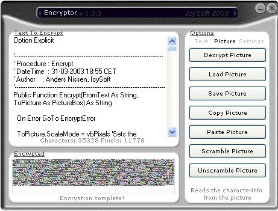



## Encryptor: Encrypting Text To Picture

### Description

Encryptor is a different encryption program. It encrypts the given text by converting the text into a picture that can be decrypted again. Basically the program uses the ASCII- and character-values of the letters to convert it from text to picture and back again. The text is hidden in the pixels of the picture and is can be *perfectly* encrypted and decrypted – meaning that every character, symbol etc. can be encrypted & decrypted including spaces and line changes.

Please compile and run the application for the full effect of the graphical design and encryptions speed.

The code is heavily commented so everyone should be able to understand the processes. Thorough project documentation is included in the zip.

All feedback is most appreciated, but this is my first submission on PSC, so please be gentle ;)

*** UPDATED 04-04-2003 ***

-Now checks the Windows OS version to avoid using API liberies that only exists on NT-systems.

-Prompts the user to change display settings if the current display isn't using true color.

-A few other small cosmetical modifications.
 
### More Info
 
The text to encrypt.

An image containing the encrypted text. The image can be copied or saved.

None (...that I am aware of)

             |
---                |---
**Submitted On**   |2003-04-03 18:14:40
**By**             |[Anders Nissen](https://github.com/Planet-Source-Code/PSCIndex/blob/master/ByAuthor/anders-nissen.md)
**Level**          |Advanced
**User Rating**    |4.9 (34 globes from 7 users)
**Compatibility**  |VB 5\.0, VB 6\.0
**Category**       |[Encryption](https://github.com/Planet-Source-Code/PSCIndex/blob/master/ByCategory/encryption__1-48.md)
**World**          |[Visual Basic](https://github.com/Planet-Source-Code/PSCIndex/blob/master/ByWorld/visual-basic.md)
**Archive File**   |[Encryptor\_156910442003\.zip](https://github.com/Planet-Source-Code/anders-nissen-encryptor-encrypting-text-to-picture__1-44463/archive/master.zip)

